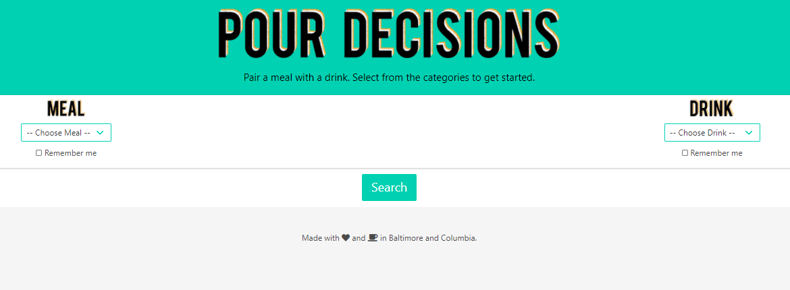
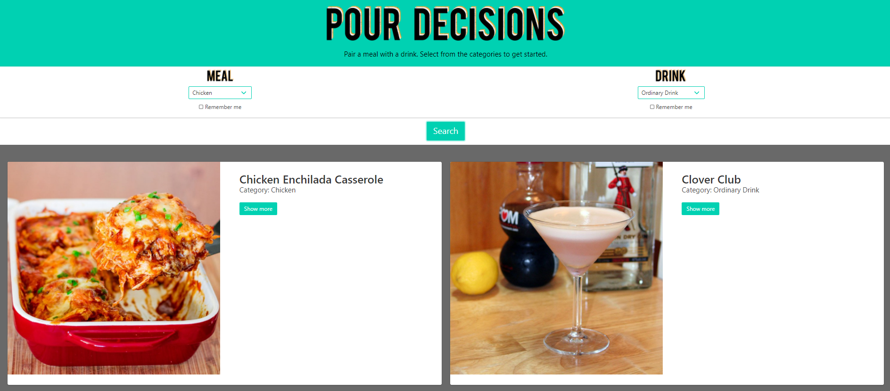

# Pour-Decision
## Description
Pour Decision is a quick and easy way to get a recipe for a meal and a drink. The app returns a meal and drink card with ingredients, photographs, and a recipe.  Don't like the results? Run the search again! The results are random. And if you like the drink but want a new meal, or vis versa, check the Remember Me checkbox and the app will keep the results for that category.
## Deployed Link(https://jrtwheeler.github.io/Pour-Decision/)
## Usage
To use the app, follow the deployed link, or [click here](https://jrtwheeler.github.io/Pour-Decision/). Choose a principal ingrediant from the meal and drink dropdowns and then click the search button. To save a result click the Remember Me checkbox. The app will store results for that category.

## Authors
This page was developed with equal contributions from [ddunkle](https://github.com/ddunkle) and [SeeMoreGold](https://github.com/SeeMoreGold). To write the project, we used the following:
* Javascript
* JQUERY
* CSS
* HTML
* Bootstrap
* Bulma
* API
* https://www.themealdb.com/api
* https://www.thecocktaildb.com/api
* AJAX calls
## License
Copyright (c) Microsoft Corporation. All rights reserved.

Licensed under the MIT license.
## Planned Updates
In the future the team plans to add Youtube videos that the API returns to the card. 
